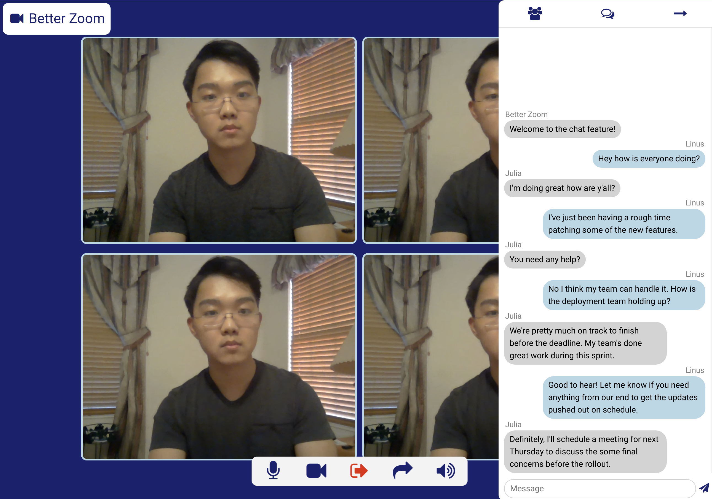

# Better-Zoom

A WebRTC video chat and messaging web application that prioritizes anonymity and simplicity.

## Description

This web application doesn't require any user credentials and allows creation of arbitrary usernames and room ID's for convenience. Users can create their own room ID's and share them, which allows complete freedom for using the platform.

## Usage

To run this project from the source code, execute these three commands in order:

`peerjs --port 3001`

`yarn run watch`

`yarn start`